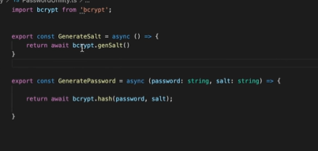

# 13 Aug

1. tsc --init (generating ts configuration file)
2. 
3. 

# 14 Aug (till 17:00)

1. In routes folder, add AdminRoute.ts, index.ts and VendorRoute.ts
2. Add this code in AdminRoute

```
import express from 'express';

const router = express.Router()

router.get('/', (req, res, next) => {
    res.json({message:'Hello from Admin'})
})

export {router as AdminRoute}
```

3. In index.ts(root), `app.use('/admin', AdminRoute)`
4. In AdminRoute, add this line `router.post('/vendor',CreateVendor)`. CreateVendor comes from the controllers.
5. In controller, create AdminController.ts and create CreateVendor, GetVendors and GetVendorById function
6. Create Vendor.dto.ts

```
export interface CreateVendorInput {
    name: string;
    ownerName: string;
    foodType: [string];
    pinCode: string;
    address: string;
    phone: string;
    email: string;
    password: string;
}
```

7. Setup the bodyParser

```
app.use(bodyParser.json())
app.use(bodyParser.urlencoded({extended: true}))
```

8. `npm i mongoose @types/mongoose`

# 15 Aug(Till 22 Minutes)

1. Create Vendor.ts inside the models
2. Create interface like this

```
interface VendorDoc extends Document{
    name: string;
    ownerName: string;
    foodType: [string];
    pincode: string;
    address: string;
    phone: string;
    email: string;
    password: string;
    salt: string;
    serviceAvailable: boolean;
    coverImages: [string];
    rating: number;
    <!-- foods: any -->
}
```

3. Create VendorSchema like this

```
const vendorSchema = new Schema({
    name: {type: String, required:true};
    ownerName: {type: String, required:true};
    foodType:  {type: [String] };
    pincode: {type: String, required:true};
    address: {type: String, required:true};
    phone: {type: String, required:true};
    email: {type: String, required:true};
    password: {type: String, required:true};
    salt: {type: String, required:true};
    serviceAvailable: {type: Boolean };
    coverImages: {type: [String] };
    rating: {type: String, required:true};
    <!-- foods: [{
        type: mongoose.SchemaTypes.ObjectId,
        ref:'food'
    }] -->
}, {
    timestamps: true
})

const Vendor = mongoose.model<VendorDoc>('vendor', VendorSchema)
export { Vendor }
```

4. Create the index.ts in config file and add mongouri there.

# 16 August(till 27:00)

1. In the root index.ts file add the mongo connection code

```
mongoose.connect(MONGO_URI, {
    useNewUrlParser: true,
    useUnifiedTopology: true,
    useCreateIndex: true,
}).then(result => {
    console.log('database connected')
}).catch(err => console.log('err'+ err))
```

2. Modify our CreateVendor function like this
   

3. Payload example
   

# 17 August(completed)

1. Check if vendor existed or not if existed return message accordingly.
   

2. Now we have to encrypt the password also. To do that we use npm i bcrypt @types/bcrypt
3. Create two utility functions GenerateSalt and GeneratePassword in PasswordUtility file.
   

4. Store the value in meaning full variable and update the values accordingly.
5. Now Inside the model delete the unnecassarily values like password and salt.
   

# 21 August(Lecture - 2 (5:30))

1. Return all the vendors in the GetVendor controller
   
2. Now return the vendor by ID in getVendorByID controller.
   

# 22 August(Lecture - 2 (10:05))

1. We will refactor the findVendor code into one function. It will accept an id and email. If email exist then find vendor using email other id.
   
2. Create Vendor Login route inside the vendors instead of admin and create controller accordingly.
3. Create VendorLoginInput interface in vendor dto with email and password types
   

# 23 August(Lecture - 2(20:00))

## Session 1

1. Inside the VendorLogin controller, Find user by email, If it null return Login credentials not valid.
2. Create utility function for comparing the password.
3. If user is not null, check if password is valid or not, if valid return user else return error message
   
4. Add new routes and controller for profile.
5. To identify the user in each request we will be using jsonwebtoken.

## Session 2

1. Create new interface Vendor payload with these properties \_id, email, name, foodTypes.
   
2. Create generateSignature utility which will return token
   
3. While login if password is valid then generate the signature and insteading of returning the user details return the signature.
4. Create Auth.dto.ts and assign it to the vendor payload
   

# 25 August(Lecture - 2 (25:46))

1. Create validateToken utility, in which fetch the Authorization from request.
2. If signature exist and split it on space and jwt.verify with app secret, assign payload to user and return true
3. else false.
   

4. Create commonAuth middleware in middleware folder.
5. Inside that declare the namespace i.e assign user to AuthPayload
   
6. Create Authenticate function, In which call our above validateToken and pass request. If valid then call next() else return not authorized.
   
7. Create GetVendorProfile controller, fetch user from request. if user is true then return the vendor. else return vendor not found.
   
8. Test it on postman

# 26 August(Lecture - 2(complete))

1. We can use router.use(Authenticate) now we dont' have to use router.post(path, middleware, controller)
2. Create interface EditVendorInputs, with name, address, phone, foodtypes
   
3. Now create updateVendorProfile. Extract the field we want to change find the vendor if it is not null update the fields and return the saved result.

4. Create route for above controller like this router.patch('/profile')
5. Create updateVendorService, Similar code to above controller but update the service and return the saved result.